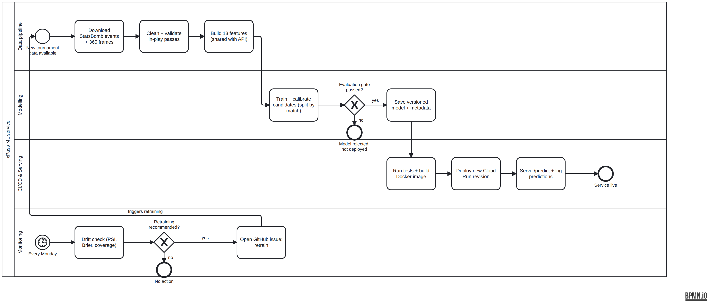
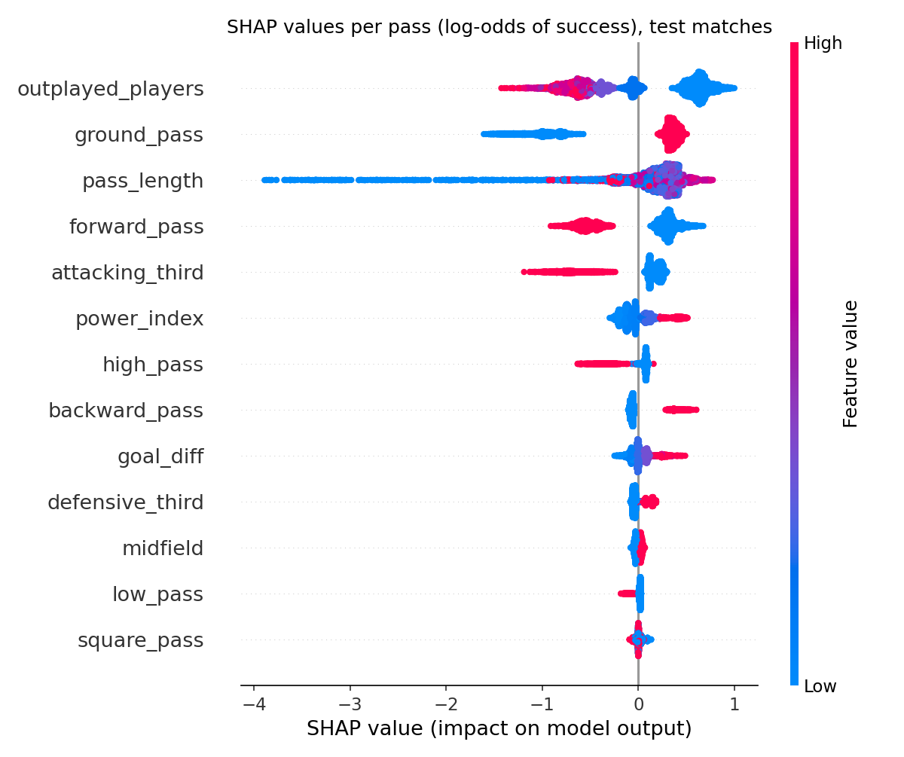

# xPass ML Service

End-to-end machine learning service for **expected pass success (xPass)** in football, built on my master's thesis
*"Generalised mixed models for evaluating passing plays in football"* (Universität Bielefeld, 2024).

The thesis trained calibrated classifiers on StatsBomb 360 data from the UEFA Women's Euro 2022.
This repository turns that research into a production-style ML service: reproducible data pipeline,
evaluation gate, API, tests, container, CI/CD to Google Cloud Run, and scheduled drift monitoring.



*Process model in BPMN 2.0 (`docs/xpass_process.bpmn`, open it in [bpmn.io](https://demo.bpmn.io) or Camunda Modeler).*

---

## Results at a glance

| | Thesis (2024) | This pipeline |
|---|---|---|
| Data | 21,918 in-play passes | 22,974 in-play passes (17,728 / 5,246) |
| Split | random hold-out | **grouped by match** (no leakage between games) |
| Imbalance | SMOTE to 1:1 | experiment: SMOTE vs. none, **none wins** |
| Model | CatBoost + isotonic calibration | CatBoost + isotonic calibration (cv=5) |
| Brier score | 0.1188 | **0.1111** |
| Log loss | 0.3725 | **0.3470** |
| Accuracy / MCC | 83.0 % / 0.49 | 83.7 % / 0.52 |
| ROC AUC | 0.865 | 0.882 |
| 5-fold grouped CV Brier | – | 0.117 ± 0.005 (the honest estimate for unseen matches) |

**Key finding.** The thesis concluded that the models *overestimate pass difficulty*.
The experiment in this pipeline shows a likely cause: oversampling with SMOTE shifts the base rate
from ~23 % to 50 % failures before calibration. With logistic regression, SMOTE lowers the mean predicted
success rate to 0.703 while the observed rate is 0.772. Training on the original distribution gives
better calibrated probabilities for both model types (`reports/evaluation.md`).

Top players by xPass score (≥ 51 passes) match the thesis rankings: Griedge Mbock Bathy Nka,
Nicky Evrard, Laura De Neve, Elena Linari, Martina Rosucci (`reports/player_scores.csv`).

---


## Pipeline: every step and its output

| Step | Command | What happens | Output |
|---|---|---|---|
| 0 Process model | `python scripts/make_bpmn.py` | ML lifecycle as BPMN 2.0 with 4 lanes | `docs/xpass_process.bpmn` |
| 1 Ingest | `make data` | Download events + 360 frames of all 31 matches from StatsBomb open data | `data/raw/euro2022/*.parquet`, `manifest.json` (content hash = data version) |
| 2 Clean | `make features` | Keep in-play passes; drop set pieces, offside, unknown outcome, injury clearance, missing values | `data/processed/euro2022_passes.parquet` |
| 3 Features | (same) | 13 thesis features: pass height, pitch third, direction, length, outplayed players (from 360 frame), goal difference at pass time, opponent power index | `euro2022_summary.json` |
| 4 Split | `make train` | `GroupShuffleSplit` by `match_id`, 80/20 | 18,526 train / 4,448 test passes |
| 5 Experiments | (same) | {logistic regression, CatBoost} × {SMOTE, no resampling}, each with isotonic calibration | `reports/experiments.json` |
| 6 Selection | (same) | Lowest Brier score wins | `metadata.json → model` |
| 7 Artifacts | (same) | Versioned model, risk clusters (Gaussian mixture), metadata incl. drift reference | `models/xpass_model.joblib`, `risk_gmm.joblib`, `metadata.json` |
| 8 Evaluation gate | (same) | Brier ≤ 0.13, log loss ≤ 0.42, AUC ≥ 0.84, otherwise exit code 1 → CI blocks deployment | `reports/evaluation.md` |
| 9 Batch scoring | (same) | Thesis Algorithm 1: score = mean(outcome − xPass) for players with ≥ 51 passes | `reports/player_scores.csv` |
| 10 Serving | `make serve` | FastAPI: `/health`, `/predict`, `/players/top`; every prediction logged as JSON | http://localhost:8000/docs |
| 11 Tests | `make test` | 25 tests: feature logic, model contract, API incl. invalid input (422) | pytest report |
| 12 Container | `make docker` | Slim image with API + model only, non-root user | `xpass-api` image |
| 13 CI/CD | `.github/workflows/ci-cd.yml` | Test → build → push to Artifact Registry → deploy Cloud Run revision → smoke test | new revision + URL |
| 14 Cloud | see below | Google Cloud Run, scales to zero, free tier | public URL |
| 15 Drift | `make drift TAG=wwc2023` | PSI per feature, prediction drift, opponent coverage, Brier on new data; weekly via GitHub Actions, opens an issue | `reports/drift_<tag>.md` |
| 17 Explain | `make explain` | SHAP (global, local, grouped) compared with CatBoost importance and grouped permutation importance | `reports/explainability.md`, `docs/shap_*.png` |
| 16 Retrain | `make train VERSION=1.1.0` | New version, gate runs again, canary / rollback via Cloud Run revisions | `models/` v1.1.0 |

### Example request

```bash
curl -X POST http://localhost:8000/predict -H "Content-Type: application/json" -d '{
  "height": "ground", "start_x": 60, "start_y": 40, "end_x": 45, "end_y": 38,
  "outplayed_players": 0, "goal_diff": 4, "opponent": "Norway"}'
# {"xpass": 0.9977, "risk_category": "non-risky", "model_version": "1.0.0"}
```

Coordinates follow StatsBomb (pitch 120 × 80 yards, attacking left to right).

---

## Explainability: what drives xPass

`make explain` explains the production model with **SHAP** (TreeExplainer on the 5 CatBoost models inside
the calibrator) and checks the result against two other methods. Full report: [`reports/explainability.md`](reports/explainability.md).
The master's thesis used LIME and CatBoost's built-in importance; this adds SHAP and a systematic comparison.



| Finding | Evidence |
|---|---|
| Ground passes, few outplayed opponents, backward direction and medium length make a pass easy | Global SHAP, direction table |
| **Pass length is non-monotonic**: passes under 3 yards succeed only 16 % of the time (blocked or miscontrolled), 8–30 yards are safest, long passes get harder again | SHAP dependence plot + observed success by length bin |
| Long passes are harder when they go forward | SHAP interaction (dependence plot coloured by direction) |
| SHAP and the built-in importance largely agree | Spearman rank correlation 0.94 |
| **The power index is used but does not help**: grouped SHAP ranks it 6th, but shuffling it does not worsen the Brier score at all | Grouped permutation importance ≈ 0, consistent with the ablation (grouped CV Brier 0.1165 without vs 0.1167 with it) |
| One-hot features must be judged as groups | Grouped SHAP (additivity) and grouped permutation (shuffle the group together, so no impossible passes) |

Two caveats: SHAP explains the **raw CatBoost score (log-odds) before isotonic calibration**, so the contributions do not add
up to the final calibrated xPass; and SHAP describes what the model **uses**, permutation importance on held-out data what
actually **helps prediction**. Both views are needed.

---

## Drift monitoring: what it found

| New data | Unknown opponents | Brier (ref 0.111) | Decision |
|---|---|---|---|
| Women's World Cup 2023 | **66 %** | 0.134 | retrain |
| Women's Euro 2025 | 13 % | 0.109 | retrain (coverage) |

The pass-level features are stable (PSI < 0.1). The problem is the **opponent power index**:
it is a lookup table for the 16 Euro 2022 teams, so most World Cup opponents have no value.
This is a classic training-serving gap and the next improvement (see *Known limitations*).

---

## Deploy to Google Cloud Run (free tier)

**Step-by-step guide with Git and GitHub Actions: [docs/DEPLOYMENT.md](docs/DEPLOYMENT.md)** (every command with its expected output, plus troubleshooting). Short version below.

One-time setup (about 30 minutes). Cloud Run's free tier covers far more than a demo needs,
but a billing account (credit card) is required. **Set a budget alert first.**

```bash
# 0. Install the gcloud CLI, then:
gcloud auth login
gcloud projects create xpass-demo-<yourname> && gcloud config set project xpass-demo-<yourname>
# link a billing account in the console, then create a budget alert (e.g. 1 EUR)

# 1. Enable services
gcloud services enable run.googleapis.com artifactregistry.googleapis.com \
  iamcredentials.googleapis.com cloudbuild.googleapis.com

# 2. Artifact Registry repository for the images
gcloud artifacts repositories create xpass --repository-format=docker --location=europe-west3

# 3. First deployment by hand (builds in the cloud, no local Docker needed)
gcloud run deploy xpass-api --source . --region europe-west3 \
  --allow-unauthenticated --max-instances=1 --memory=1Gi
# -> prints the service URL; open <URL>/docs
```

### Automatic deployment from GitHub (Workload Identity Federation, no key files)

```bash
PROJECT_ID=$(gcloud config get-value project)
PROJECT_NUMBER=$(gcloud projects describe $PROJECT_ID --format='value(projectNumber)')
REPO=<github-user>/xpass-ml-service

gcloud iam service-accounts create github-deployer
SA=github-deployer@$PROJECT_ID.iam.gserviceaccount.com
for ROLE in roles/run.admin roles/artifactregistry.writer roles/iam.serviceAccountUser; do
  gcloud projects add-iam-policy-binding $PROJECT_ID --member=serviceAccount:$SA --role=$ROLE
done

gcloud iam workload-identity-pools create github --location=global
gcloud iam workload-identity-pools providers create-oidc github-provider \
  --location=global --workload-identity-pool=github \
  --issuer-uri=https://token.actions.githubusercontent.com \
  --attribute-mapping=google.subject=assertion.sub,attribute.repository=assertion.repository \
  --attribute-condition="assertion.repository=='$REPO'"

gcloud iam service-accounts add-iam-policy-binding $SA --role=roles/iam.workloadIdentityUser \
  --member="principalSet://iam.googleapis.com/projects/$PROJECT_NUMBER/locations/global/workloadIdentityPools/github/attribute.repository/$REPO"
```

Then add these **repository variables** in GitHub (Settings → Secrets and variables → Actions → Variables):

| Variable | Value |
|---|---|
| `GCP_PROJECT_ID` | your project ID |
| `GCP_WIF_PROVIDER` | `projects/<PROJECT_NUMBER>/locations/global/workloadIdentityPools/github/providers/github-provider` |
| `GCP_DEPLOY_SA` | `github-deployer@<PROJECT_ID>.iam.gserviceaccount.com` |

Every push to `main` now runs the tests, builds the image and deploys a new revision.

**Rollback:** `gcloud run services update-traffic xpass-api --region europe-west3 --to-revisions=<old-revision>=100`
**Canary:** `--to-revisions=<new>=10,<old>=90`

---

## Run locally

```bash
python -m venv .venv && source .venv/bin/activate
pip install -r requirements-dev.txt
make all          # data -> features -> train -> test
make serve        # http://localhost:8000/docs
make drift TAG=wwc2023
```

## Repository layout

```
src/xpass/        config, ingest, features (shared with API), train, api, drift
tests/            feature, model-contract and API tests
models/           versioned model artifacts + metadata.json (drift reference inside)
reports/          evaluation, experiments, player scores, drift reports
data/reference/   power index lookup (versioned reference data)
docs/             BPMN process model, deployment guide
scripts/          BPMN generator, ablation experiments
.github/workflows CI/CD and weekly drift check
```

## Known limitations and next steps

1. **Power index uses future information.** It is built from the FIFA ranking after the tournament and
   from goals conceded over the whole tournament (as in the thesis). A point-in-time version would use the
   pre-tournament ranking and goals conceded up to the match.
2. **Power index does not generalise** to teams outside Euro 2022 (drift report), and an ablation shows it adds
   no signal (grouped-CV Brier 0.1165 without vs. 0.1167 with it). A model without it scores 100 % of World Cup 2023
   passes with Brier 0.120. Next version: drop it or replace it with a point-in-time ranking.
3. **Outplayed players is an optimistic upper bound**: 360 frames show only the broadcast view and
   opponents' positions at pass start (thesis section 3.1.1).
4. Player scores are computed on all passes (in-sample), as in the thesis.
5. **Explanations are model-specific.** The thesis model (SMOTE, random split) ranked goal difference first; the production model ranks it low. Explanations describe a model, not the game.
6. Monitoring reads new tournaments from StatsBomb. In a live product, it would read the logged
   predictions from Cloud Logging, and performance monitoring would wait for outcomes (labels).

## Data

StatsBomb open data, used under the [StatsBomb public data user agreement](https://github.com/statsbomb/open-data).
Data is downloaded by `make data` and not stored in this repository.
