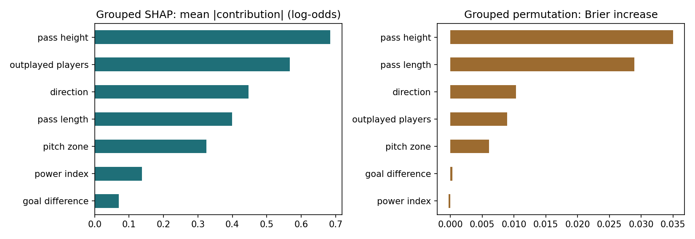
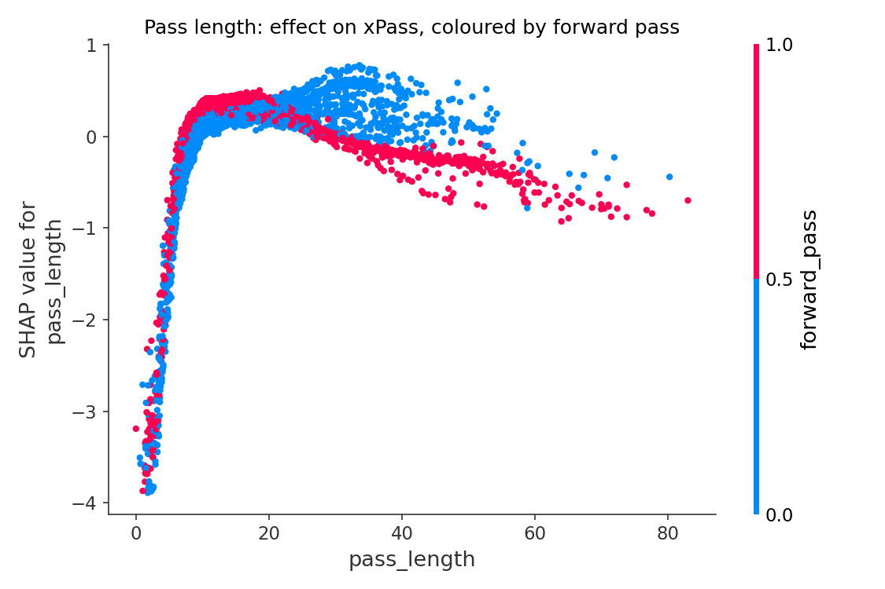
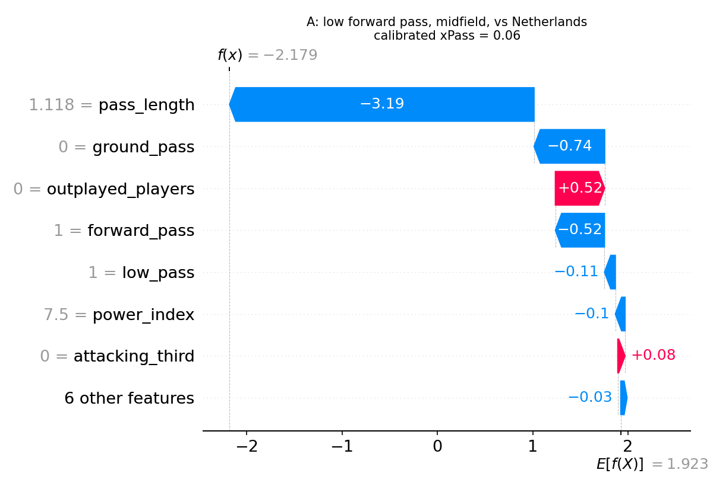
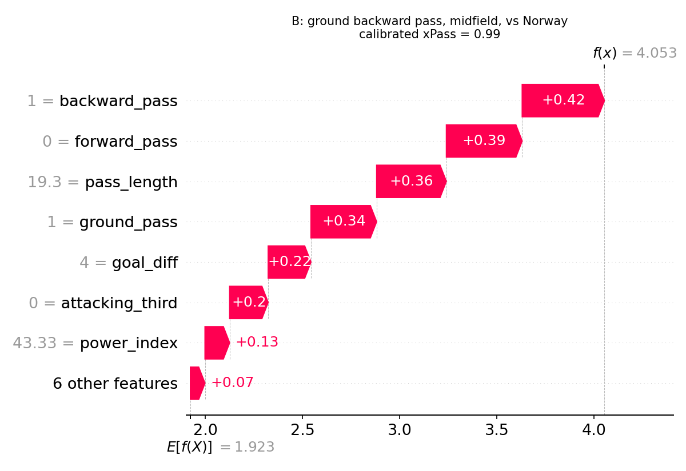

# Explainability report

Production model, 4,448 passes from held-out test matches. SHAP values are in log-odds of pass success, averaged over the 5 CatBoost models inside the calibrator.

Additivity check: base value + sum of SHAP values reproduces the raw model output with a maximum error of 1.1e-14.

## 1. Individual features: SHAP vs CatBoost built-in importance (thesis Table 3.10)

|                   |   SHAP mean abs |   SHAP rank |   built-in |   built-in rank |
|:------------------|----------------:|------------:|-----------:|----------------:|
| outplayed_players |           0.566 |           1 |      15.37 |               3 |
| ground_pass       |           0.547 |           2 |      20.37 |               2 |
| pass_length       |           0.4   |           3 |      24.97 |               1 |
| forward_pass      |           0.397 |           4 |       8.37 |               4 |
| attacking_third   |           0.289 |           5 |       7.93 |               5 |
| power_index       |           0.137 |           6 |       6.71 |               6 |
| high_pass         |           0.127 |           7 |       3.05 |               9 |
| backward_pass     |           0.117 |           8 |       4.11 |               8 |
| goal_diff         |           0.07  |           9 |       4.24 |               7 |
| defensive_third   |           0.063 |          10 |       1.64 |              10 |
| midfield          |           0.027 |          11 |       0.98 |              12 |
| low_pass          |           0.025 |          12 |       0.64 |              13 |
| square_pass       |           0.022 |          13 |       1.63 |              11 |

Rank agreement (Spearman): 0.94.

## 2. Feature groups: grouped SHAP vs grouped permutation importance

One-hot features are evaluated as groups (summed SHAP; columns shuffled together).

|                   |   grouped SHAP |   SHAP rank |   permutation (Brier +) |   perm. rank |
|:------------------|---------------:|------------:|------------------------:|-------------:|
| pass height       |          0.684 |           1 |                  0.035  |            1 |
| outplayed players |          0.566 |           2 |                  0.0089 |            4 |
| direction         |          0.447 |           3 |                  0.0103 |            3 |
| pass length       |          0.4   |           4 |                  0.0289 |            2 |
| pitch zone        |          0.325 |           5 |                  0.0061 |            5 |
| power index       |          0.137 |           6 |                 -0.0003 |            7 |
| goal difference   |          0.07  |           7 |                  0.0003 |            6 |

Rank agreement (Spearman): 0.82.

## 3. Direction of each feature's effect

| feature           | type    |   mean SHAP if 1 |   mean SHAP if 0 | effect                                     |
|:------------------|:--------|-----------------:|-----------------:|:-------------------------------------------|
| ground_pass       | binary  |            0.357 |           -1.014 | raises xPass                               |
| low_pass          | binary  |           -0.097 |            0.017 | lowers xPass                               |
| high_pass         | binary  |           -0.358 |            0.072 | lowers xPass                               |
| defensive_third   | binary  |            0.108 |           -0.043 | raises xPass                               |
| midfield          | binary  |            0.026 |           -0.028 | raises xPass                               |
| attacking_third   | binary  |           -0.683 |            0.18  | lowers xPass                               |
| backward_pass     | binary  |            0.389 |           -0.069 | raises xPass                               |
| square_pass       | binary  |           -0.006 |            0.011 | lowers xPass                               |
| forward_pass      | binary  |           -0.534 |            0.318 | lowers xPass                               |
| pass_length       | numeric |          nan     |          nan     | higher value raises xPass (Spearman +0.28) |
| outplayed_players | numeric |          nan     |          nan     | higher value lowers xPass (Spearman -0.92) |
| goal_diff         | numeric |          nan     |          nan     | higher value raises xPass (Spearman +0.94) |
| power_index       | numeric |          nan     |          nan     | higher value raises xPass (Spearman +0.94) |

## 4. Two passes explained (the LIME examples from the thesis)

**A: low forward pass, midfield, vs Netherlands**: base +1.92 → raw -2.18 log-odds (uncalibrated p = 0.10) → calibrated xPass = 0.06

| feature | SHAP |
|---|---|
| pass_length | -3.193 |
| ground_pass | -0.740 |
| outplayed_players | +0.517 |
| forward_pass | -0.515 |
| low_pass | -0.114 |
| power_index | -0.102 |

**B: ground backward pass, midfield, vs Norway**: base +1.92 → raw +4.05 log-odds (uncalibrated p = 0.98) → calibrated xPass = 0.99

| feature | SHAP |
|---|---|
| backward_pass | +0.423 |
| forward_pass | +0.390 |
| pass_length | +0.358 |
| ground_pass | +0.338 |
| goal_diff | +0.220 |
| attacking_third | +0.198 |

## 5. Pass length is not monotonic

A single correlation hides the shape: very short 'passes' (often blocked or miscontrolled) mostly fail, medium passes are safest, long passes get harder again.

|               |   passes |   observed success |   mean SHAP of pass_length |
|:--------------|---------:|-------------------:|---------------------------:|
| (0.0, 3.0]    |       77 |              0.156 |                     -3.297 |
| (3.0, 5.0]    |      128 |              0.383 |                     -2.134 |
| (5.0, 8.0]    |      365 |              0.778 |                     -0.506 |
| (8.0, 12.0]   |      694 |              0.849 |                      0.13  |
| (12.0, 20.0]  |     1397 |              0.871 |                      0.284 |
| (20.0, 30.0]  |     1018 |              0.831 |                      0.296 |
| (30.0, 45.0]  |      547 |              0.645 |                      0.131 |
| (45.0, 130.0] |      221 |              0.371 |                     -0.301 |

## Plots

 
